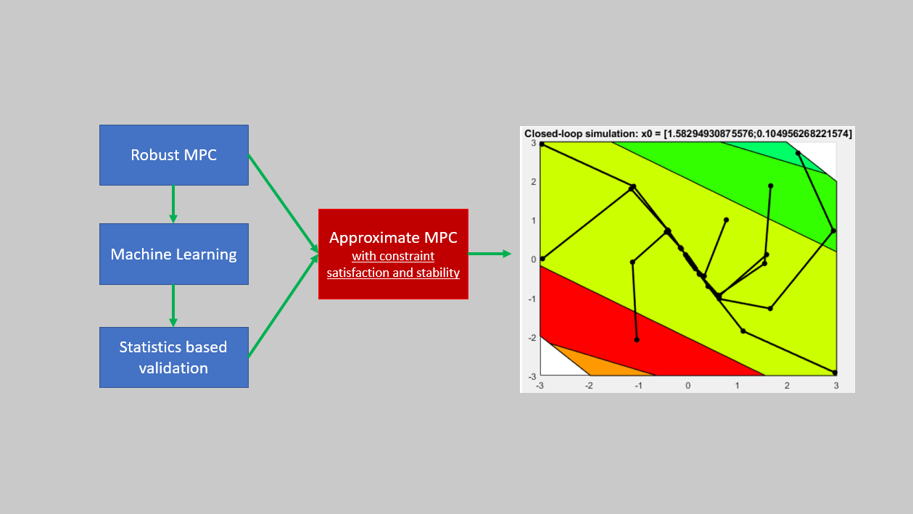

# DeepLearning-Robust-MPC-Estimation

Hi ! :wave:

Sorry for the mess in this project's code and readMe! I am currently cleaning the project's code and building :construction_worker: the readMe! It will be soon updated, yet you can still look at the code and at the <a href='./Project Report.pdf'>report</a> that summarizes all the theory and workflow. :smiley:

The aim of this project is to use a Deep Learning model to estimate an MPC (Method Predictive Control) control law. Using a neural network to estimate the control law reduces the computational cost required. Yet, one problem is that the model will only give an estimation of the ideal control law. To ensure respect of constraints and system stability, the Deep Learning model estimates the control law of a Robust MPC controller (implemented in Matlab).

  

The method used in this project is inspired by Michael Hertneck's paper [[1]](#1) and thesis [[2]](#2).

Wait for the update ...  :hourglass:

## References

<a id="1">[1]</a> Michael Hertneck et al. “Learning an Approximate Model Predictive Controller with Guarantees”.
In: IEEE Control Systems Letters 2 (3 July 2018), pp. 543–548. issn: 24751456. doi: <a href="https://doi.org/10.1109/LCSYS.2018.2843682">https://doi.org/10.1109/LCSYS.2018.2843682</a>.

<a id="2">[2]</a> Michael Hertneck et al. Learning an Approximate Model Predictive Controller with Guarantees
Student Thesis. 2018.